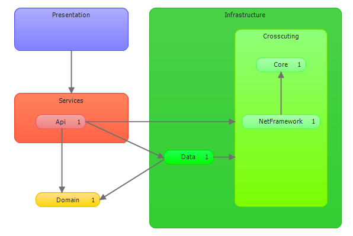

#Business Template

This is a service solution that can be used as a template to generate applications using ASP.Net Web Api. 

The architecture can grow to N layers as needed.

If you use visual studio with modeling capabilities you can validate the layers with the architecture layer diagram.



The api is documented with [swagger](http://swagger.io/ "Swagger UI") and can be explored.

To populate the database run the following command in the Package Manager Console:

```
Update-Database -ProjectName Infrastructure.Data -StartUpProjectName Api
```
